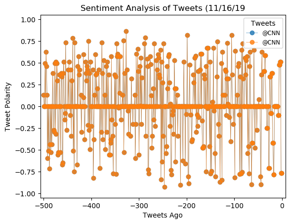
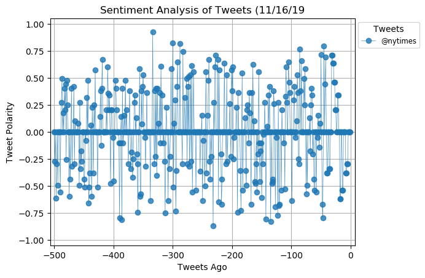

# Twitter_plotbot
Tweepy, vaderSentiment, Heroku

Build a twitter bot that sends sentiment analysis for tweets by another twitter user. The pattern used will be "@projecttestonly Analyze: @CNN". Tweets like this will trigger the bot to perform a sentiment analysis on the target user (@CNN). The outputs should look similar to:

